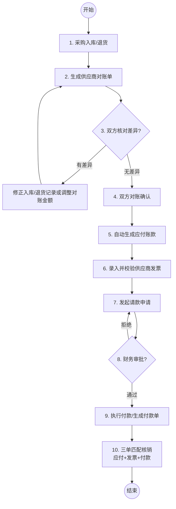

# 根据账期对账结算-付款-核销流程设计（先收货后结算）

## 1. 流程概述
本流程适用于“先货后款”的业务场景。企业先接收供应商货物并参加入库，在约定的账期结束时，根据入库记录进行对账，确认应付金额后，经过发票核对、请款审批，最终完成付款和核销。

## 2. 业务角色
- **采购员**：负责采购入库、退货记录的录入与维护。
- **供应商**：参与对账单核对、提供发票。
- **财务人员**：负责对账单确认、发票校验、请款审批、付款执行及最终核销。

## 3. 业务流程图

## 4. 关键步骤说明

### 4.1 采购入库/退货 (Purchase Record)
- 记录供应商发货后的实际收货明细。
- 退货记录以负数金额体现，用于冲抵应付。
- 只有“已确认”状态的入库/退货单才能进入对账。

### 4.2 供应商对账 (Supplier Statement)
- **汇总**：系统按账期自动汇总已确认的入库和退货记录。
- **差异处理**：对比企业净额与供应商提供的对账金额。若有差异，需追溯明细并修正。
- **双重确认**：供应商先确认，采购方后确认。确认后锁定数据不可修改。

### 4.3 应付账款管理 (Accounts Payable)
- 对账确认后，系统自动生成应付账款记录。
- 初始化状态：付款状态=未付款，核销状态=未核销。

### 4.4 请款与付款 (Payment Request & Order)
- **请款**：必须关联已校验的发票，且请款金额不得超过发票总额。
- **付款**：请款单审批通过后，出纳执行付款并记录付款单。

### 4.5 三单匹配核销 (Verification)
- 财务人员将“应付账款”、“付款单”、“发票”进行关联匹配。
- 核销金额规则：`核销金额 <= min(应付未核销金额, 付款未核销金额, 发票未核销金额)`。
- 完全核销标志着该笔业务往来的闭环。

## 5. 数据关联模型
- **应付账款** (1) <---> (1) **对账单**
- **对账单** (1) <---> (N) **采购入库/退货单**
- **发票** (N) <---> (1) **应付账款**
- **请款单** (N) <---> (1) **应付账款** & (N) **发票**
- **核销记录** (1) <---> (1) **应付账款** & (1) **付款单** & (1) **发票**
