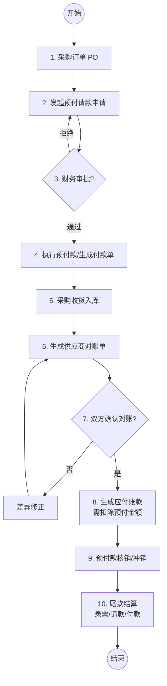

# 采购单预付-对账结算-核销流程设计（先付款后结算）

## 1. 流程概述
本流程适用于“先款后货”或“定金/预付”业务场景。企业在收到货物前，根据采购订单发起预付款申请，并在后期收货后通过对账单进行结算，最后将预付款项与实际应收款项进行对冲核销。

## 2. 业务角色
- **采购员**：负责发起预付申请、录入采购收货记录。
- **财务人员**：负责预付审批、付款执行、对账单确认、尾款结算及预付核销。
- **供应商**：接收预付款、发货、参与对账。

## 3. 业务流程图

## 4. 关键步骤说明

### 4.1 预付请款 (Prepayment Request)
- 关联采购订单（PO），通常按订单总额的一定比例（如 30% 定金或 100% 全款）发起。
- 此时尚未产生入库记录，应付账款也尚未生成。

### 4.2 预付款执行 (Prepayment Execution)
- 财务审批通过后，产生付款记录。
- 该笔款项在会计上记为“预付账款”。

### 4.3 采购入库与对账 (Receiving & Reconciliation)
- 收到货物后录入“采购入库记录”。
- 生成对账单时，系统需展示：
    - 入库明细与总额。
    - **已预付金额**。
    - 待结算净额（入库总额 - 已预付金额）。

### 4.4 预付核销 (Prepayment Offset/Verification)
- 对账确认并生成应付账款后，首先将之前的“预付款”与生成的“应付账款”进行内部核销。
- 核销后，应付账款的“已付金额”增加，从而反映出真实的“待付尾款”。

### 4.5 尾款结算 (Final Settlement)
- 供应商根据对账结果开具发票（包含预付部分）。
- 采购方针对剩余的“待付尾款”进行正常的请款、审批和付款流程。

## 5. 数据关联模型
- **预付请款单** (N) <---> (1) **采购订单 PO**
- **付款单** (1) <---> (1) **预付请款单**
- **对账单** (1) <---> (N) **采购入库单** & (N) **预付付款单**
- **应付账款** (1) <---> (1) **对账单**
- **核销记录**：
    - 阶段一：**预付款** (Offset) **应付账款**
    - 阶段二：**尾款付款** + **发票** (Verify) **应付账款**
